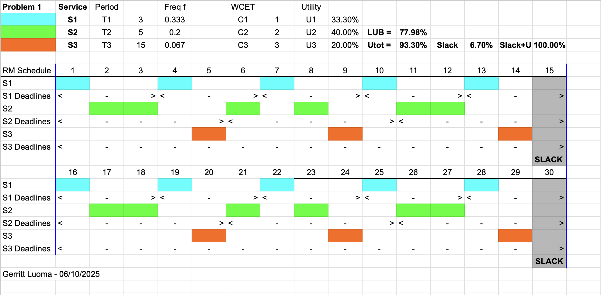
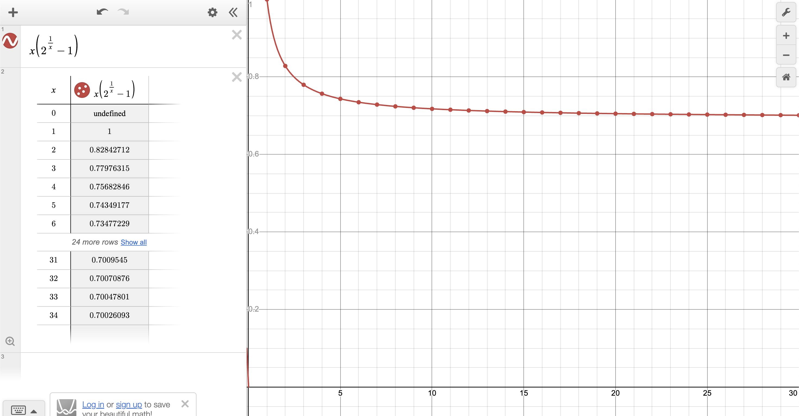

# RTES Assignment 1
Repository for the first assignment of CU Boulder's Real Time Embedded Systems course


## Additional Sources
- [Geeks for Geeks RMS](https://www.geeksforgeeks.org/rate-monotonic-scheduling/)

## Problem 1

> The Rate Monotonic Policy states that services which share a CPU core should multiplex it (with context switches that preempt and dispatch tasks) based on priority, where highest priority is assigned to the most frequently requested service and lowest priority is assigned to the least frequently requested AND total shared CPU core utilization must preserve some margin (not be fully utilized or overloaded).


> A: Draw a timing diagram for three services S1, S2, and S3 with T1=3, C1=1, T2=5, C2=2, T3=15, C3=3 where all times are in milliseconds.

> B: Label your diagram carefully and describe whether you think the schedule is feasible (mathematically repeatable as an invariant indefinitely) and safe (unlikely to ever miss a deadline).

> C: What is the total CPU utilization by the three services?

A: Below is the diagram of services S1, S2, and S3 with their defined periods and durations.  The raw spreadsheet used to generate this screenshot can be found at [assets/problem-1-diagram.xlsx](./assets/problem-1-diagram.xlsx)

<p align="center">
    
</p>

B: In the image, each service has two rows.  The first row, labelled with just the service name, shows the currently active service based off the time step in milliseconds.  The second row, labelled with the service name + Deadline, graphically shows the deadline iterations of the service shown with `< - >`.  If there is no active service at a given time, the column is grayed out and is labelled as `Slack`.  Additionally, the period, service duration, and CPU utilization are all provided above the diagram along with the calulated Least Upper Bound (LUB) and CPU Utilization (U).

Purely based off visual analysis I believe this schedule of services is repeatable and safe.  Due to the services having harmonic frequencies and durations, the services are able to perform a repeatable pattern throughout each service set.  Additional mathematical analysis will be performed in part C.

C: To calculate the total CPU usage you simply sum up the quotient of the service computation times to their periods.  This is defined below:

$$
U = \sum_{i=1}^{n} \frac{C_i}{T_i}
$$

Where:
- \( C_i \) is the computation time of task \( i \)
- \( T_i \) is the period of task \( i \)
- \( n \) is the total number of tasks

For the current set of services the total CPU usage is:

$$
U = \frac{1}{3} + \frac{2}{5} + \frac{3}{15} = 0.933 = 93.33\\%
$$

A simple check to perform a baseline validation of the safety of the services is to calulate the LUB of the services.  The LUB can be calculated with:

$$
U_{\text{max}} = n(2^{1/n} - 1)
$$

Where:
- \( n \) is the number of tasks

For the current set of services the LUB is:

$$
U_{\text{max}} = 3(2^{1/3} - 1) \approx 0.78 \approx 78\\%
$$

To guarantee a system is schedulable under RMP the total CPU time must be less than or equal to the LUB otherwise additional verification is required.  In the case of these services, it is not guaranteed to be shedulable due to the total CPU usage being greater than the LUB.

After performing a by hand analysis in section B it is determined that this set of services is repeatable and safe due to the harmonic nature of their periods and computation periods.  If any of the periods were changed it could easily lead to the system not being schedulable.

---

## Problem 2

> Read through the Apollo 11 Lunar lander computer overload story as reported in RTECS Notes, based on this NASA account, and the descriptions of the 1201/1202 events described by chief software engineer Margaret Hamilton as recounted by Dylan Matthews. Summarize the story.

This story is about the 1201 and 1202 error codes that caused CPU reboots of the Apollo 11 flight computer during the landing phase of the mission that almost caused a mission abort.  The issue arose due to a misconfiguration of the radar switches leading to repeated low priority jobs being spawned to process rendezvous radar data that was not needed at the time.

Since the flight computer had very limited RAM, 2048 15-bit words, all of the real time jobs had to share a pool of 12 total RAM locations, 7 of which were considered core sets used by all spawned jobs and 5 of which were VAC areas which were larger.  Each time a job was spawned it would scan for the first open core set and, if needed, the first open VAC set to acquire for the duration of the job.  In the event of no VAC areas being available, the program would branch to the Alarm/Abort routine and raise error 1201.  In the event of no core sets being available it would raise error 1202.  Both of these errors would cause a CPU reboot.

Since the radars were generating data when the weren't supposed to, the core sets were eventually all taken up leading to 1202 error being raised.  Later in the landing, all of the VAC sets were taken up leading to a 1201 error being raised.  Due to the extensive testing done by MIT, specifically in error handling and reboots, the important tasks like GNC and ADCS were properly restarted while the faulty low priority tasks weren't allowing the mission to continue to the eventual landing.

> A: What was the root cause of the overload and why did it violate Rate Monotonic policy?

The root cause of the overload was the misconfiguration of the rendezvous radar leading to low priority tasks that weren't needed at the time hogging the shared resource pool of the higher priority tasks.  RMP assumes that resources are always available for high priority tasks which was not the case here leading to the errors being raised causing CPU reboots.

> B: Now, read Liu and Layland’s paper which describes Rate Monotonic policy and the Least Upper Bound – they derive an equation which advises margin of approximately 30% of the total CPU as the number of services sharing a single CPU core increases.

This paper defines the Least Upper Bound (LUB) that I referenced during question 1.  The idea of the LUB is that if the total CPU utilization of your tasks is less than the LUB, it is guaranteed to be schedulable using RMS.

$$
U = \sum_{i=1}^{n} \frac{C_i}{T_i} \leq n\left(2^{1/n} - 1\right)
$$

The reason why advised margin is roughly 30% is because this equation reaches a limit that is just below 70% of total CPU consumption meaning once you reach a certain number of tasks in the system, as long as their total CPU load is under that limit they will be guaranteed to be schedulable under RMS.

> C: Plot this Least Upper bound as a function of number of services.

Below is a plot of the LUB equation demonstrating how it very quickly begins to approach a value of 70% after just 5-10 tasks.

<p align="center">
    
</p>

> D: Describe three key assumptions Liu and Layland make and document three or more aspects of their fixed priority LUB derivation that you do not understand.

Key Assumptions all pulled from (C. L. Liu and J. W. Layland):
1. Requests for all tasks for which hard deadlines are **periodic** with a constant interval between requests.
   1. This is where the period, or $T_n$ value, comes from when plotting or calculating RMS.  This is also where the basis of scheduling comes from since we are trying to schedule periodic tasks for the life of a program.
2. Tasks are independent in that requests for certain tasks do not depend on the initiation or completion of requests for other tasks.
   1. This intuitively makes sense to me since we need to be able to schedule and run tasks whenever they are available according to the scheduler.  If a higher priority task relied on a lower priority task, it would be impossible to run.
3. Run time for each task is constant for that task and does not vary with time. Run time here refers to the time which is taken by a processor to execute the task without interruption.
   1. This is where the $C_n$ value comes from when calculating RMS.  In other readings and on the slides this is mentioned as the worst case run time for the task which should be close or exactly on the average of the task run time in a real time system

Aspects of the derivation I don't understand or am confused by:
1. This seems to be a pretty idealized set of constraints.  In my experience, there is a relatively constant flow of interrputs being fired due to I/O while talking with external components.  How does one take the information of the LUB and then use it for a real world system?
2. I have also used one shot tasks in the past or tasks that aren't necessarily periodic but instead are called on an as-needed basis.  How can these fit into the calculation of LUB since the first assumption is that these tasks are periodic?
3. This paper is specifically written for analyzing single core scheduling.  I understand that SMP is much more complex but how much more complex will the math get for calculating something akin to LUB when dealing with 2 or more processors?

> E: Would RM analysis have prevented the Apollo 11 1201/1202 errors and potential mission abort? Why or why not?

I don't believe that RM analysis could have prevented thee errors on the Apollo 11 mission.  The situation described sounded like an off-nominal configuration leading to the breaking of RMP instead of a nominal software configuration leading to the fault.  This appears to be more of a symptom of improper testing or user error leading to the rendezvous radar producing the data.  In this particular case, I interpreted that the radar data shouldn't have been getting processed at all during the landing phase of the mission.  If that is the case, the RM analysis would have most likely been done not accounting for the radar data in the first place leading to this fault still occurring.  Instead, it was due to proper testing of the error handling and the intelligence of the restart system being able to bring back up critical tasks while ditching lower priority tasks (like the radar processing) that allowed for the mission to continue and successfully land.

---

## Problem 3

> Download RT-Clock and build it on an R-Pi3b+ or newer and execute the code.

Below is the output from running the program as-is.
```bash
Before adjustments to scheduling policy:
Pthread Policy is SCHED_OTHER
After adjustments to scheduling policy:
Pthread Policy is SCHED_FIFO


POSIX Clock demo using system RT clock with resolution:
	0 secs, 0 microsecs, 1 nanosecs
test 0
MY_CLOCK clock DT seconds = 0, msec=10, usec=10013, nsec=10013148, sec=0.010013148
MY_CLOCK delay error = 0, nanoseconds = 13148
test 1
MY_CLOCK clock DT seconds = 0, msec=10, usec=10012, nsec=10012314, sec=0.010012314
MY_CLOCK delay error = 0, nanoseconds = 12314
test 2
MY_CLOCK clock DT seconds = 0, msec=10, usec=10011, nsec=10011389, sec=0.010011389
MY_CLOCK delay error = 0, nanoseconds = 11389
test 3
MY_CLOCK clock DT seconds = 0, msec=10, usec=10010, nsec=10010259, sec=0.010010259
MY_CLOCK delay error = 0, nanoseconds = 10259
test 4
MY_CLOCK clock DT seconds = 0, msec=10, usec=10009, nsec=10009815, sec=0.010009815
MY_CLOCK delay error = 0, nanoseconds = 9815
test 5
MY_CLOCK clock DT seconds = 0, msec=10, usec=10010, nsec=10010463, sec=0.010010463
MY_CLOCK delay error = 0, nanoseconds = 10463
test 6
MY_CLOCK clock DT seconds = 0, msec=10, usec=10010, nsec=10010482, sec=0.010010482
MY_CLOCK delay error = 0, nanoseconds = 10482
test 7
MY_CLOCK clock DT seconds = 0, msec=10, usec=10010, nsec=10010333, sec=0.010010333
MY_CLOCK delay error = 0, nanoseconds = 10333
test 8
MY_CLOCK clock DT seconds = 0, msec=10, usec=10010, nsec=10010148, sec=0.010010148
MY_CLOCK delay error = 0, nanoseconds = 10148
test 9
MY_CLOCK clock DT seconds = 0, msec=10, usec=10009, nsec=10009056, sec=0.010009056
MY_CLOCK delay error = 0, nanoseconds = 9056
test 10
MY_CLOCK clock DT seconds = 0, msec=10, usec=10009, nsec=10009407, sec=0.010009407
MY_CLOCK delay error = 0, nanoseconds = 9407
test 11
MY_CLOCK clock DT seconds = 0, msec=10, usec=10010, nsec=10010111, sec=0.010010111
MY_CLOCK delay error = 0, nanoseconds = 10111
test 12
MY_CLOCK clock DT seconds = 0, msec=10, usec=10010, nsec=10010500, sec=0.010010500
MY_CLOCK delay error = 0, nanoseconds = 10500
test 13
MY_CLOCK clock DT seconds = 0, msec=10, usec=10010, nsec=10010408, sec=0.010010408
MY_CLOCK delay error = 0, nanoseconds = 10408
test 14
MY_CLOCK clock DT seconds = 0, msec=10, usec=10009, nsec=10009833, sec=0.010009833
MY_CLOCK delay error = 0, nanoseconds = 9833
test 15
MY_CLOCK clock DT seconds = 0, msec=10, usec=10009, nsec=10009926, sec=0.010009926
MY_CLOCK delay error = 0, nanoseconds = 9926
test 16
MY_CLOCK clock DT seconds = 0, msec=10, usec=10010, nsec=10010444, sec=0.010010444
MY_CLOCK delay error = 0, nanoseconds = 10444
test 17
MY_CLOCK clock DT seconds = 0, msec=10, usec=10010, nsec=10010092, sec=0.010010092
MY_CLOCK delay error = 0, nanoseconds = 10092
test 18
MY_CLOCK clock DT seconds = 0, msec=10, usec=10010, nsec=10010537, sec=0.010010537
MY_CLOCK delay error = 0, nanoseconds = 10537
test 19
MY_CLOCK clock DT seconds = 0, msec=10, usec=10010, nsec=10010981, sec=0.010010981
MY_CLOCK delay error = 0, nanoseconds = 10981
test 20
MY_CLOCK clock DT seconds = 0, msec=10, usec=10010, nsec=10010130, sec=0.010010130
MY_CLOCK delay error = 0, nanoseconds = 10130
test 21
MY_CLOCK clock DT seconds = 0, msec=10, usec=10010, nsec=10010223, sec=0.010010223
MY_CLOCK delay error = 0, nanoseconds = 10223
test 22
MY_CLOCK clock DT seconds = 0, msec=10, usec=10010, nsec=10010111, sec=0.010010111
MY_CLOCK delay error = 0, nanoseconds = 10111
test 23
MY_CLOCK clock DT seconds = 0, msec=10, usec=10010, nsec=10010019, sec=0.010010019
MY_CLOCK delay error = 0, nanoseconds = 10019
test 24
MY_CLOCK clock DT seconds = 0, msec=10, usec=10010, nsec=10010334, sec=0.010010334
MY_CLOCK delay error = 0, nanoseconds = 10334
test 25
MY_CLOCK clock DT seconds = 0, msec=10, usec=10009, nsec=10009481, sec=0.010009481
MY_CLOCK delay error = 0, nanoseconds = 9481
test 26
MY_CLOCK clock DT seconds = 0, msec=10, usec=10009, nsec=10009278, sec=0.010009278
MY_CLOCK delay error = 0, nanoseconds = 9278
test 27
MY_CLOCK clock DT seconds = 0, msec=10, usec=10010, nsec=10010556, sec=0.010010556
MY_CLOCK delay error = 0, nanoseconds = 10556
test 28
MY_CLOCK clock DT seconds = 0, msec=10, usec=10010, nsec=10010833, sec=0.010010833
MY_CLOCK delay error = 0, nanoseconds = 10833
test 29
MY_CLOCK clock DT seconds = 0, msec=10, usec=10009, nsec=10009537, sec=0.010009537
MY_CLOCK delay error = 0, nanoseconds = 9537
test 30
MY_CLOCK clock DT seconds = 0, msec=10, usec=10009, nsec=10009704, sec=0.010009704
MY_CLOCK delay error = 0, nanoseconds = 9704
test 31
MY_CLOCK clock DT seconds = 0, msec=10, usec=10010, nsec=10010185, sec=0.010010185
MY_CLOCK delay error = 0, nanoseconds = 10185
test 32
MY_CLOCK clock DT seconds = 0, msec=10, usec=10010, nsec=10010018, sec=0.010010018
MY_CLOCK delay error = 0, nanoseconds = 10018
test 33
MY_CLOCK clock DT seconds = 0, msec=10, usec=10011, nsec=10011426, sec=0.010011426
MY_CLOCK delay error = 0, nanoseconds = 11426
test 34
MY_CLOCK clock DT seconds = 0, msec=10, usec=10010, nsec=10010333, sec=0.010010333
MY_CLOCK delay error = 0, nanoseconds = 10333
test 35
MY_CLOCK clock DT seconds = 0, msec=10, usec=10010, nsec=10010167, sec=0.010010167
MY_CLOCK delay error = 0, nanoseconds = 10167
test 36
MY_CLOCK clock DT seconds = 0, msec=10, usec=10009, nsec=10009259, sec=0.010009259
MY_CLOCK delay error = 0, nanoseconds = 9259
test 37
MY_CLOCK clock DT seconds = 0, msec=10, usec=10010, nsec=10010463, sec=0.010010463
MY_CLOCK delay error = 0, nanoseconds = 10463
test 38
MY_CLOCK clock DT seconds = 0, msec=10, usec=10010, nsec=10010055, sec=0.010010055
MY_CLOCK delay error = 0, nanoseconds = 10055
test 39
MY_CLOCK clock DT seconds = 0, msec=10, usec=10012, nsec=10012092, sec=0.010012092
MY_CLOCK delay error = 0, nanoseconds = 12092
test 40
MY_CLOCK clock DT seconds = 0, msec=10, usec=10011, nsec=10011852, sec=0.010011852
MY_CLOCK delay error = 0, nanoseconds = 11852
test 41
MY_CLOCK clock DT seconds = 0, msec=10, usec=10009, nsec=10009630, sec=0.010009630
MY_CLOCK delay error = 0, nanoseconds = 9630
test 42
MY_CLOCK clock DT seconds = 0, msec=10, usec=10009, nsec=10009351, sec=0.010009351
MY_CLOCK delay error = 0, nanoseconds = 9351
test 43
MY_CLOCK clock DT seconds = 0, msec=10, usec=10010, nsec=10010833, sec=0.010010833
MY_CLOCK delay error = 0, nanoseconds = 10833
test 44
MY_CLOCK clock DT seconds = 0, msec=10, usec=10010, nsec=10010204, sec=0.010010204
MY_CLOCK delay error = 0, nanoseconds = 10204
test 45
MY_CLOCK clock DT seconds = 0, msec=10, usec=10010, nsec=10010463, sec=0.010010463
MY_CLOCK delay error = 0, nanoseconds = 10463
test 46
MY_CLOCK clock DT seconds = 0, msec=10, usec=10009, nsec=10009648, sec=0.010009648
MY_CLOCK delay error = 0, nanoseconds = 9648
test 47
MY_CLOCK clock DT seconds = 0, msec=10, usec=10010, nsec=10010222, sec=0.010010222
MY_CLOCK delay error = 0, nanoseconds = 10222
test 48
MY_CLOCK clock DT seconds = 0, msec=10, usec=10010, nsec=10010389, sec=0.010010389
MY_CLOCK delay error = 0, nanoseconds = 10389
test 49
MY_CLOCK clock DT seconds = 0, msec=10, usec=10010, nsec=10010704, sec=0.010010704
MY_CLOCK delay error = 0, nanoseconds = 10704
test 50
MY_CLOCK clock DT seconds = 0, msec=10, usec=10009, nsec=10009740, sec=0.010009740
MY_CLOCK delay error = 0, nanoseconds = 9740
test 51
MY_CLOCK clock DT seconds = 0, msec=10, usec=10009, nsec=10009111, sec=0.010009111
MY_CLOCK delay error = 0, nanoseconds = 9111
test 52
MY_CLOCK clock DT seconds = 0, msec=10, usec=10009, nsec=10009186, sec=0.010009186
MY_CLOCK delay error = 0, nanoseconds = 9186
test 53
MY_CLOCK clock DT seconds = 0, msec=10, usec=10010, nsec=10010426, sec=0.010010426
MY_CLOCK delay error = 0, nanoseconds = 10426
test 54
MY_CLOCK clock DT seconds = 0, msec=10, usec=10009, nsec=10009148, sec=0.010009148
MY_CLOCK delay error = 0, nanoseconds = 9148
test 55
MY_CLOCK clock DT seconds = 0, msec=10, usec=10010, nsec=10010148, sec=0.010010148
MY_CLOCK delay error = 0, nanoseconds = 10148
test 56
MY_CLOCK clock DT seconds = 0, msec=10, usec=10010, nsec=10010055, sec=0.010010055
MY_CLOCK delay error = 0, nanoseconds = 10055
test 57
MY_CLOCK clock DT seconds = 0, msec=10, usec=10009, nsec=10009537, sec=0.010009537
MY_CLOCK delay error = 0, nanoseconds = 9537
test 58
MY_CLOCK clock DT seconds = 0, msec=10, usec=10010, nsec=10010259, sec=0.010010259
MY_CLOCK delay error = 0, nanoseconds = 10259
test 59
MY_CLOCK clock DT seconds = 0, msec=10, usec=10010, nsec=10010203, sec=0.010010203
MY_CLOCK delay error = 0, nanoseconds = 10203
test 60
MY_CLOCK clock DT seconds = 0, msec=10, usec=10010, nsec=10010148, sec=0.010010148
MY_CLOCK delay error = 0, nanoseconds = 10148
test 61
MY_CLOCK clock DT seconds = 0, msec=10, usec=10009, nsec=10009222, sec=0.010009222
MY_CLOCK delay error = 0, nanoseconds = 9222
test 62
MY_CLOCK clock DT seconds = 0, msec=10, usec=10009, nsec=10009129, sec=0.010009129
MY_CLOCK delay error = 0, nanoseconds = 9129
test 63
MY_CLOCK clock DT seconds = 0, msec=10, usec=10010, nsec=10010259, sec=0.010010259
MY_CLOCK delay error = 0, nanoseconds = 10259
test 64
MY_CLOCK clock DT seconds = 0, msec=10, usec=10010, nsec=10010278, sec=0.010010278
MY_CLOCK delay error = 0, nanoseconds = 10278
test 65
MY_CLOCK clock DT seconds = 0, msec=10, usec=10010, nsec=10010148, sec=0.010010148
MY_CLOCK delay error = 0, nanoseconds = 10148
test 66
MY_CLOCK clock DT seconds = 0, msec=10, usec=10010, nsec=10010278, sec=0.010010278
MY_CLOCK delay error = 0, nanoseconds = 10278
test 67
MY_CLOCK clock DT seconds = 0, msec=10, usec=10009, nsec=10009592, sec=0.010009592
MY_CLOCK delay error = 0, nanoseconds = 9592
test 68
MY_CLOCK clock DT seconds = 0, msec=10, usec=10010, nsec=10010166, sec=0.010010166
MY_CLOCK delay error = 0, nanoseconds = 10166
test 69
MY_CLOCK clock DT seconds = 0, msec=10, usec=10020, nsec=10020611, sec=0.010020611
MY_CLOCK delay error = 0, nanoseconds = 20611
test 70
MY_CLOCK clock DT seconds = 0, msec=10, usec=10011, nsec=10011055, sec=0.010011055
MY_CLOCK delay error = 0, nanoseconds = 11055
test 71
MY_CLOCK clock DT seconds = 0, msec=10, usec=10010, nsec=10010611, sec=0.010010611
MY_CLOCK delay error = 0, nanoseconds = 10611
test 72
MY_CLOCK clock DT seconds = 0, msec=10, usec=10010, nsec=10010425, sec=0.010010425
MY_CLOCK delay error = 0, nanoseconds = 10425
test 73
MY_CLOCK clock DT seconds = 0, msec=10, usec=10008, nsec=10008667, sec=0.010008667
MY_CLOCK delay error = 0, nanoseconds = 8667
test 74
MY_CLOCK clock DT seconds = 0, msec=10, usec=10010, nsec=10010537, sec=0.010010537
MY_CLOCK delay error = 0, nanoseconds = 10537
test 75
MY_CLOCK clock DT seconds = 0, msec=10, usec=10010, nsec=10010482, sec=0.010010482
MY_CLOCK delay error = 0, nanoseconds = 10482
test 76
MY_CLOCK clock DT seconds = 0, msec=10, usec=10010, nsec=10010222, sec=0.010010222
MY_CLOCK delay error = 0, nanoseconds = 10222
test 77
MY_CLOCK clock DT seconds = 0, msec=10, usec=10010, nsec=10010167, sec=0.010010167
MY_CLOCK delay error = 0, nanoseconds = 10167
test 78
MY_CLOCK clock DT seconds = 0, msec=10, usec=10016, nsec=10016740, sec=0.010016740
MY_CLOCK delay error = 0, nanoseconds = 16740
test 79
MY_CLOCK clock DT seconds = 0, msec=10, usec=10010, nsec=10010777, sec=0.010010777
MY_CLOCK delay error = 0, nanoseconds = 10777
test 80
MY_CLOCK clock DT seconds = 0, msec=10, usec=10010, nsec=10010241, sec=0.010010241
MY_CLOCK delay error = 0, nanoseconds = 10241
test 81
MY_CLOCK clock DT seconds = 0, msec=10, usec=10010, nsec=10010518, sec=0.010010518
MY_CLOCK delay error = 0, nanoseconds = 10518
test 82
MY_CLOCK clock DT seconds = 0, msec=10, usec=10012, nsec=10012315, sec=0.010012315
MY_CLOCK delay error = 0, nanoseconds = 12315
test 83
MY_CLOCK clock DT seconds = 0, msec=10, usec=10008, nsec=10008667, sec=0.010008667
MY_CLOCK delay error = 0, nanoseconds = 8667
test 84
MY_CLOCK clock DT seconds = 0, msec=10, usec=10010, nsec=10010056, sec=0.010010056
MY_CLOCK delay error = 0, nanoseconds = 10056
test 85
MY_CLOCK clock DT seconds = 0, msec=10, usec=10010, nsec=10010037, sec=0.010010037
MY_CLOCK delay error = 0, nanoseconds = 10037
test 86
MY_CLOCK clock DT seconds = 0, msec=10, usec=10010, nsec=10010260, sec=0.010010260
MY_CLOCK delay error = 0, nanoseconds = 10260
test 87
MY_CLOCK clock DT seconds = 0, msec=10, usec=10010, nsec=10010204, sec=0.010010204
MY_CLOCK delay error = 0, nanoseconds = 10204
test 88
MY_CLOCK clock DT seconds = 0, msec=10, usec=10009, nsec=10009778, sec=0.010009778
MY_CLOCK delay error = 0, nanoseconds = 9778
test 89
MY_CLOCK clock DT seconds = 0, msec=10, usec=10010, nsec=10010093, sec=0.010010093
MY_CLOCK delay error = 0, nanoseconds = 10093
test 90
MY_CLOCK clock DT seconds = 0, msec=10, usec=10010, nsec=10010222, sec=0.010010222
MY_CLOCK delay error = 0, nanoseconds = 10222
test 91
MY_CLOCK clock DT seconds = 0, msec=10, usec=10010, nsec=10010222, sec=0.010010222
MY_CLOCK delay error = 0, nanoseconds = 10222
test 92
MY_CLOCK clock DT seconds = 0, msec=10, usec=10010, nsec=10010259, sec=0.010010259
MY_CLOCK delay error = 0, nanoseconds = 10259
test 93
MY_CLOCK clock DT seconds = 0, msec=10, usec=10010, nsec=10010092, sec=0.010010092
MY_CLOCK delay error = 0, nanoseconds = 10092
test 94
MY_CLOCK clock DT seconds = 0, msec=10, usec=10009, nsec=10009556, sec=0.010009556
MY_CLOCK delay error = 0, nanoseconds = 9556
test 95
MY_CLOCK clock DT seconds = 0, msec=10, usec=10010, nsec=10010092, sec=0.010010092
MY_CLOCK delay error = 0, nanoseconds = 10092
test 96
MY_CLOCK clock DT seconds = 0, msec=10, usec=10010, nsec=10010388, sec=0.010010388
MY_CLOCK delay error = 0, nanoseconds = 10388
test 97
MY_CLOCK clock DT seconds = 0, msec=10, usec=10010, nsec=10010185, sec=0.010010185
MY_CLOCK delay error = 0, nanoseconds = 10185
test 98
MY_CLOCK clock DT seconds = 0, msec=10, usec=10010, nsec=10010000, sec=0.010010000
MY_CLOCK delay error = 0, nanoseconds = 10000
test 99
MY_CLOCK clock DT seconds = 0, msec=10, usec=10009, nsec=10009500, sec=0.010009500
MY_CLOCK delay error = 0, nanoseconds = 9500
TEST COMPLETE
```

> A: Describe what the code is doing and make sure you understand clock_gettime and how to use it to time code execution (print or log timestamps between two points in your code).

The program starts through its `main()` function.  It will first print out the scheduling policy to stdout before taking one of two routes.  1, if `RUN_RT_THREAD` isn't defined it will run the test in the regular main thread which is not a `pthread`.  If the macro is defined, it will instead initialize the pthread scheduler, set it to the explicit scheduler and set it to the FIFO scheduler.  After setting the poliy, it retrieves the maximum priority from the FIFO scheduler and then sets it to the current process.

After configuring the scheduler, it will thenn call `print_scheduler()` again to print the settings of the scheduler for the current process.  After doing so, it will create a new pthread running the `delay_test()` function with the `main_sched_attr` settings.  If there wasn't an error when creating the pthread, the program will then call `pthread_join()` on the handle to that thread waiting for it to complete execution.

Within `delay_test()`, the first thing that is done is retrieving the current clock resolution using the `clock_getres()` function.  If there were no errors the program will print out the resolution of the clock before going into the main test loop of the program.  For `TEST_ITERATIONS` iterations (100 for this program), the program initializes a requested sleep time of 10 milliseconds using the defined values `TEST_SECONDS` and `TEST_NANOSECONDS`.  It then calls `clock_gettime()` to retrieve the current time from the selected clock before calling `nanosleep()` to cause the thread to sleep for the requested amount of time.  If the call to `nanosleep()` is zero, the sleep was successfully completed without an interrupt/error.  If the return value is non-zero the sleep was interrupted and is then retried up to `max_sleep_calls` iterations.  After the sleep, there is an additional call to `clock_gettime()` to get the ending time of the loop iteration.  After getting the stop time the helper method `delta_t()` is used to calculate the amount of time between the start and end time as well as the amount of error between the requested sleep duration and the actual sleep duration.  After computing the deltas the function `end_delay_test()` is called to print out the total coarse seconds, milliseconds, microseconds, and nanoseconds of the sleep as well as the seconds as a decimal value.  It also prints out the number of coarse seconds and nanoseconds of the delta between the requested and actual sleep duration.

Once the loop completes its iterations, the `pthread_join()` function call finishes and the main scheduler attributes are destroyed before the final `TEST COMPLETE` print is sent to stdout.

> B: Which clock is best to use? CLOCK_REALTIME, CLOCK_MONOTONIC or CLOCK_MONOTONIC_RAW? Please choose one and update code and improve the commenting.

By default the program is running with `CLOCK_MONOTONIC_RAW`.  For a hard realtime program I believe this is the best clock to use for the following reasons:
- This is a monotonic clock that counts the number of seconds since boot and is guaranteed to never go backwards/jump
- This clock is not adjusted by NTP meaning it will keep running at the same rate without being adjusted by external factors
- This clock is from a raw hardware timer which gives both higher resolution and deterministic timing

> C: Most RTOS vendors brag about three things: 1) Low Interrupt handler latency, 2) Low Context switch time and 3) Stable timer services where interval timer interrupts, timeouts, and knowledge of relative time has low jitter and drift. Why are each important?

1. Low interrupt latency is required in real time systems since interrupts are typically used for timers and I/O and must be serviced immediately.  The lower the interrupt latency, the less the system is spent in interrupt space instead of in the scheduled services.  Higher interrupt latency/processing time could cause the system to become unshedulable and crash.
2. The scheduler is constantly switching between services meaning it needs the lowest amount of context switching overhead possible.  Having long switching times will introduce latency into the system potentially causing services to miss deadlines or make the system unschedulable.
3. Since RMP is used in RTOSes and meaning the majority of code is periodic, the accuracy of the timers must be as high as possible to keep these periodic services running properly.  If these timers were either jittery or drift over time the periodic services will become increasingly inaccurate potentially leading to catastrophic results.

> D: Do you believe the accuracy provided by the example RT-Clock code? Why or why not?

Originally I was expecting to believe the accuracy of the RT Clock code but have noticed some interesting behavior.  When I have freshly built the code the average error of each sleep is less than 10,000 nsec but after the next run the average error is jumping up to over 20,000 nsec.  After I clean and rebuild, the first run goes back down to 10,000 nsec.  Since I am using the raw monotonic clock I was expecting it to be extremely consistent but this does not seem to be the case.  I don't believe it is a hardware issue since this occurs after multiple runs of the software and returns back to baseline after a clean rebuild.  This could be a software issue meaning the clock is in fact accurate.  On the order of true timing, this is incredibly accurate and should not be a cause for concern but in a system with hundreds of services, this could accumulate into an issue.  Below is an example of the behavior I'm seeing:

```bash
// Last 10 tests of my first run after a clean build
test 90
MY_CLOCK clock DT seconds = 0, msec=10, usec=10008, nsec=10008870, sec=0.010008870
MY_CLOCK delay error = 0, nanoseconds = 8870
test 91
MY_CLOCK clock DT seconds = 0, msec=10, usec=10008, nsec=10008981, sec=0.010008981
MY_CLOCK delay error = 0, nanoseconds = 8981
test 92
MY_CLOCK clock DT seconds = 0, msec=10, usec=10008, nsec=10008149, sec=0.010008149
MY_CLOCK delay error = 0, nanoseconds = 8149
test 93
MY_CLOCK clock DT seconds = 0, msec=10, usec=10008, nsec=10008796, sec=0.010008796
MY_CLOCK delay error = 0, nanoseconds = 8796
test 94
MY_CLOCK clock DT seconds = 0, msec=10, usec=10008, nsec=10008870, sec=0.010008870
MY_CLOCK delay error = 0, nanoseconds = 8870
test 95
MY_CLOCK clock DT seconds = 0, msec=10, usec=10008, nsec=10008815, sec=0.010008815
MY_CLOCK delay error = 0, nanoseconds = 8815
test 96
MY_CLOCK clock DT seconds = 0, msec=10, usec=10008, nsec=10008907, sec=0.010008907
MY_CLOCK delay error = 0, nanoseconds = 8907
test 97
MY_CLOCK clock DT seconds = 0, msec=10, usec=10008, nsec=10008241, sec=0.010008241
MY_CLOCK delay error = 0, nanoseconds = 8241
test 98
MY_CLOCK clock DT seconds = 0, msec=10, usec=10008, nsec=10008852, sec=0.010008852
MY_CLOCK delay error = 0, nanoseconds = 8852
test 99
MY_CLOCK clock DT seconds = 0, msec=10, usec=10008, nsec=10008889, sec=0.010008889
MY_CLOCK delay error = 0, nanoseconds = 8889
TEST COMPLETE

// Last 10 tests of my second run after a clean build
test 90
MY_CLOCK clock DT seconds = 0, msec=10, usec=10022, nsec=10022630, sec=0.010022630
MY_CLOCK delay error = 0, nanoseconds = 22630
test 91
MY_CLOCK clock DT seconds = 0, msec=10, usec=10022, nsec=10022408, sec=0.010022408
MY_CLOCK delay error = 0, nanoseconds = 22408
test 92
MY_CLOCK clock DT seconds = 0, msec=10, usec=10022, nsec=10022538, sec=0.010022538
MY_CLOCK delay error = 0, nanoseconds = 22538
test 93
MY_CLOCK clock DT seconds = 0, msec=10, usec=10022, nsec=10022444, sec=0.010022444
MY_CLOCK delay error = 0, nanoseconds = 22444
test 94
MY_CLOCK clock DT seconds = 0, msec=10, usec=10023, nsec=10023037, sec=0.010023037
MY_CLOCK delay error = 0, nanoseconds = 23037
test 95
MY_CLOCK clock DT seconds = 0, msec=10, usec=10032, nsec=10032704, sec=0.010032704
MY_CLOCK delay error = 0, nanoseconds = 32704
test 96
MY_CLOCK clock DT seconds = 0, msec=10, usec=10023, nsec=10023203, sec=0.010023203
MY_CLOCK delay error = 0, nanoseconds = 23203
test 97
MY_CLOCK clock DT seconds = 0, msec=10, usec=10022, nsec=10022500, sec=0.010022500
MY_CLOCK delay error = 0, nanoseconds = 22500
test 98
MY_CLOCK clock DT seconds = 0, msec=10, usec=10022, nsec=10022741, sec=0.010022741
MY_CLOCK delay error = 0, nanoseconds = 22741
test 99
MY_CLOCK clock DT seconds = 0, msec=10, usec=10022, nsec=10022685, sec=0.010022685
MY_CLOCK delay error = 0, nanoseconds = 22685
TEST COMPLETE
```

## Problem 4

> This is a challenging problem that requires you to learn quite a bit about Pthreads in Linux and to implement a schedule that is predictable.

> A: Download, build and run code in Linux/simplethread/ and describe how it works and what it does and compare it to Linux/simplethread-affinity.

First, let's compare the output of each of the programs.

```bash
// Simple Thread Output
Thread idx=0, sum[0...0]=0
Thread idx=1, sum[0...1]=1
Thread idx=2, sum[0...2]=3
Thread idx=5, sum[0...5]=15
Thread idx=6, sum[0...6]=21
Thread idx=7, sum[0...7]=28
Thread idx=4, sum[0...4]=10
Thread idx=3, sum[0...3]=6
Thread idx=8, sum[0...8]=36
Thread idx=9, sum[0...9]=45
Thread idx=10, sum[0...10]=55
Thread idx=11, sum[0...11]=66
TEST COMPLETE
```

```bash
// Simple Thread Affinity Output
INITIAL Pthread policy is SCHED_OTHER
ADJUSTED Pthread policy is SCHED_FIFO
main thread running on CPU=1, CPUs = 0 1 2 3
starter thread running on CPU=3

Thread idx=0, sum[0...0]=0, running on CPU=3, start=1749768864.208045, stop=1749768864.218633
Thread idx=1, sum[0...1]=1, running on CPU=3, start=1749768864.218992, stop=1749768864.239580
Thread idx=2, sum[0...2]=3, running on CPU=3, start=1749768864.239696, stop=1749768864.263082
Thread idx=3, sum[0...3]=6, running on CPU=3, start=1749768864.263168, stop=1749768864.295444
Thread idx=4, sum[0...4]=10, running on CPU=3, start=1749768864.295593, stop=1749768864.335513
Thread idx=5, sum[0...5]=15, running on CPU=3, start=1749768864.335571, stop=1749768864.360594
Thread idx=6, sum[0...6]=21, running on CPU=3, start=1749768864.360632, stop=1749768864.390103
Thread idx=7, sum[0...7]=28, running on CPU=3, start=1749768864.390152, stop=1749768864.424067
Thread idx=8, sum[0...8]=36, running on CPU=3, start=1749768864.424111, stop=1749768864.462471
Thread idx=9, sum[0...9]=45, running on CPU=3, start=1749768864.462525, stop=1749768864.505334
Thread idx=10, sum[0...10]=55, running on CPU=3, start=1749768864.505380, stop=1749768864.552635
Thread idx=11, sum[0...11]=66, running on CPU=3, start=1749768864.552680, stop=1749768864.604385
Thread idx=12, sum[0...12]=78, running on CPU=3, start=1749768864.604431, stop=1749768864.660597
Thread idx=13, sum[0...13]=91, running on CPU=3, start=1749768864.660649, stop=1749768864.721265
Thread idx=14, sum[0...14]=105, running on CPU=3, start=1749768864.721323, stop=1749768864.786393
Thread idx=15, sum[0...15]=120, running on CPU=3, start=1749768864.786441, stop=1749768864.855946
Thread idx=16, sum[0...16]=136, running on CPU=3, start=1749768864.855991, stop=1749768864.929934
Thread idx=17, sum[0...17]=153, running on CPU=3, start=1749768864.929981, stop=1749768865.008371
Thread idx=18, sum[0...18]=171, running on CPU=3, start=1749768865.008416, stop=1749768865.091256
Thread idx=19, sum[0...19]=190, running on CPU=3, start=1749768865.091301, stop=1749768865.178688
Thread idx=20, sum[0...20]=210, running on CPU=3, start=1749768865.178768, stop=1749768865.270498
Thread idx=21, sum[0...21]=231, running on CPU=3, start=1749768865.270565, stop=1749768865.366741
Thread idx=22, sum[0...22]=253, running on CPU=3, start=1749768865.366803, stop=1749768865.467433
Thread idx=23, sum[0...23]=276, running on CPU=3, start=1749768865.467497, stop=1749768865.572568
Thread idx=24, sum[0...24]=300, running on CPU=3, start=1749768865.572630, stop=1749768865.682150
Thread idx=25, sum[0...25]=325, running on CPU=3, start=1749768865.682213, stop=1749768865.796182
Thread idx=26, sum[0...26]=351, running on CPU=3, start=1749768865.796243, stop=1749768865.914708
Thread idx=27, sum[0...27]=378, running on CPU=3, start=1749768865.914773, stop=1749768866.037641
Thread idx=28, sum[0...28]=406, running on CPU=3, start=1749768866.037704, stop=1749768866.165058
Thread idx=29, sum[0...29]=435, running on CPU=3, start=1749768866.165132, stop=1749768866.296975
Thread idx=30, sum[0...30]=465, running on CPU=3, start=1749768866.297045, stop=1749768866.433290
Thread idx=31, sum[0...31]=496, running on CPU=3, start=1749768866.433358, stop=1749768866.574028
Thread idx=32, sum[0...32]=528, running on CPU=3, start=1749768866.574136, stop=1749768866.733837
Thread idx=33, sum[0...33]=561, running on CPU=3, start=1749768866.733907, stop=1749768866.898469
Thread idx=34, sum[0...34]=595, running on CPU=3, start=1749768866.898540, stop=1749768867.067022
Thread idx=35, sum[0...35]=630, running on CPU=3, start=1749768867.067149, stop=1749768867.240130
Thread idx=36, sum[0...36]=666, running on CPU=3, start=1749768867.240213, stop=1749768867.418128
Thread idx=37, sum[0...37]=703, running on CPU=3, start=1749768867.418249, stop=1749768867.600605
Thread idx=38, sum[0...38]=741, running on CPU=3, start=1749768867.600694, stop=1749768867.786936
Thread idx=39, sum[0...39]=780, running on CPU=3, start=1749768867.787001, stop=1749768867.977743
Thread idx=40, sum[0...40]=820, running on CPU=3, start=1749768867.977813, stop=1749768868.173507
Thread idx=41, sum[0...41]=861, running on CPU=3, start=1749768868.173583, stop=1749768868.373844
Thread idx=42, sum[0...42]=903, running on CPU=3, start=1749768868.373930, stop=1749768868.577969
Thread idx=43, sum[0...43]=946, running on CPU=3, start=1749768868.578040, stop=1749768868.786532
Thread idx=44, sum[0...44]=990, running on CPU=3, start=1749768868.786602, stop=1749768869.000138
Thread idx=45, sum[0...45]=1035, running on CPU=3, start=1749768869.000203, stop=1749768869.218145
Thread idx=46, sum[0...46]=1081, running on CPU=3, start=1749768869.218241, stop=1749768869.440181
Thread idx=47, sum[0...47]=1128, running on CPU=3, start=1749768869.440289, stop=1749768869.666648
Thread idx=48, sum[0...48]=1176, running on CPU=3, start=1749768869.666756, stop=1749768869.898041
Thread idx=49, sum[0...49]=1225, running on CPU=3, start=1749768869.898148, stop=1749768870.133958
Thread idx=50, sum[0...50]=1275, running on CPU=3, start=1749768870.134099, stop=1749768870.373829
Thread idx=51, sum[0...51]=1326, running on CPU=3, start=1749768870.373961, stop=1749768870.618036
Thread idx=52, sum[0...52]=1378, running on CPU=3, start=1749768870.618129, stop=1749768870.867198
Thread idx=53, sum[0...53]=1431, running on CPU=3, start=1749768870.867271, stop=1749768871.120817
Thread idx=54, sum[0...54]=1485, running on CPU=3, start=1749768871.120905, stop=1749768871.378379
Thread idx=55, sum[0...55]=1540, running on CPU=3, start=1749768871.378452, stop=1749768871.640314
Thread idx=56, sum[0...56]=1596, running on CPU=3, start=1749768871.640398, stop=1749768871.907281
Thread idx=57, sum[0...57]=1653, running on CPU=3, start=1749768871.907374, stop=1749768872.178723
Thread idx=58, sum[0...58]=1711, running on CPU=3, start=1749768872.178800, stop=1749768872.454067
Thread idx=59, sum[0...59]=1770, running on CPU=3, start=1749768872.454140, stop=1749768872.733783
Thread idx=60, sum[0...60]=1830, running on CPU=3, start=1749768872.733884, stop=1749768873.018564
Thread idx=61, sum[0...61]=1891, running on CPU=3, start=1749768873.018704, stop=1749768873.307809
Thread idx=62, sum[0...62]=1953, running on CPU=3, start=1749768873.307941, stop=1749768873.601291
Thread idx=63, sum[0...63]=2016, running on CPU=3, start=1749768873.601394, stop=1749768873.898901
TEST COMPLETE
```

It appears that both of the programs are spawning threads that are iterating a specified amount of times and summing all of the natural numbers from 0..N of the current iteration.  `simplethread` is iterating only 12 times while `simplethread-afinity` is iterating 64 times. Besides the output of each iteration, `simplethread` provides no extra value.  `simplethread-afinity` provides additional information regarding the scheduling policy, available CPUs, and the CPU that each thread is running on.  It appears that for this run, the main thread ran on CPU 1, the starter thread ran on CPU 3, and each of the counting threads ran on CPU 3.

When looking at the code for `simplethread`, it is making no alterations to the scheduling policy or the attributes of the threads.  It simply uses `pthread_create` to spawn in `NUM_THREADS` pthreads with their specified number of iterations to perform and then joins them together as seen below:

```c
int main (int argc, char *argv[])
{
   int rc;
   int i;

   for(i=0; i < NUM_THREADS; i++)
   {
       threadParams[i].threadIdx=i;

       pthread_create(&threads[i],   // pointer to thread descriptor
                      (void *)0,     // use default attributes
                      counterThread, // thread function entry point
                      (void *)&(threadParams[i]) // parameters to pass in
                     );

   }

   for(i=0;i<NUM_THREADS;i++)
       pthread_join(threads[i], NULL);

   printf("TEST COMPLETE\n");
}
```

`simplethread-affinity` is doing essentially the same procedure with a little bit of extra processing before.  First, the program calls the `set_scheduler()` function, seen below, to perform initialization of pthread attributes struct.  In this function it explicitly sets the scheduler to `FIFO` using the the `pthread_attr_setinheritsched()` and `pthread_attr_setschedpolicy()` functions.  After this, it uses the `CPU_ZERO` macro made available by defining `_GNU_SOURCE` to zero out a `cpu_set_t` struct before setting the available CPU index to 3.  After retrieving the maximum priotity of the `FIFO` policy, the scheduler of the current program is updated and the function ends.

```c
void set_scheduler(void)
{
    int max_prio, scope, rc, cpuidx;
    cpu_set_t cpuset;

    printf("INITIAL "); print_scheduler();

    pthread_attr_init(&fifo_sched_attr);
    pthread_attr_setinheritsched(&fifo_sched_attr, PTHREAD_EXPLICIT_SCHED);
    pthread_attr_setschedpolicy(&fifo_sched_attr, SCHED_POLICY);
    CPU_ZERO(&cpuset);
    cpuidx=(3);
    CPU_SET(cpuidx, &cpuset);
    pthread_attr_setaffinity_np(&fifo_sched_attr, sizeof(cpu_set_t), &cpuset);

    max_prio=sched_get_priority_max(SCHED_POLICY);
    fifo_param.sched_priority=max_prio;    

    if((rc=sched_setscheduler(getpid(), SCHED_POLICY, &fifo_param)) < 0)
        perror("sched_setscheduler");

    pthread_attr_setschedparam(&fifo_sched_attr, &fifo_param);

    printf("ADJUSTED "); print_scheduler();
}
```

The main thread then gets the thread affinity of the main thread using `pthread_get_affinity_np()` and confirms it was successful before printing out the CPU the main thread is running on and the available CPUs the thread could have ran on.  Finally, the main thread creates a pthread calling the `starterThread()` function with the scheduler attributes configured during `set_scheduler()` and then joins on the thread.  The full main function can be seen below:

```c
int main (int argc, char *argv[])
{
   int rc;
   int i, j;
   cpu_set_t cpuset;

   set_scheduler();

   CPU_ZERO(&cpuset);

   // get affinity set for main thread
   mainthread = pthread_self();

   // Check the affinity mask assigned to the thread 
   rc = pthread_getaffinity_np(mainthread, sizeof(cpu_set_t), &cpuset);
   if (rc != 0)
       perror("pthread_getaffinity_np");
   else
   {
       printf("main thread running on CPU=%d, CPUs =", sched_getcpu());

       for (j = 0; j < CPU_SETSIZE; j++)
           if (CPU_ISSET(j, &cpuset))
               printf(" %d", j);

       printf("\n");
   }

   pthread_create(&startthread,   // pointer to thread descriptor
                  &fifo_sched_attr,     // use FIFO RT max priority attributes
                  starterThread, // thread function entry point
                  (void *)0 // parameters to pass in
                 );

   pthread_join(startthread, NULL);

   printf("\nTEST COMPLETE\n");
}
```

The `starterThread()` function simply outputs the CPU it is running on before creating `NUM_THREADS` pthreads with the same configured scheduler attributes from `set_scheduler()` and joins on those threads.  This function can be seen below:

```c
void *starterThread(void *threadp)
{
   int i, rc;

   printf("starter thread running on CPU=%d\n", sched_getcpu());

   for(i=0; i < NUM_THREADS; i++)
   {
       threadParams[i].threadIdx=i;

       pthread_create(&threads[i],   // pointer to thread descriptor
                      &fifo_sched_attr,     // use FIFO RT max priority attributes
                      counterThread, // thread function entry point
                      (void *)&(threadParams[i]) // parameters to pass in
                     );

   }

   for(i=0;i<NUM_THREADS;i++)
       pthread_join(threads[i], NULL);

}
```

To make the timing more obvious compared to the `simplethread` example, the counter thread will perform the summation a total of `MAX_ITERATION` times and times the duration using the `gettimeofday()` function before printing the thread ID, sum, CPU it ran on, and timing information.  Each of the threads are running on CPU #3 because it was selected in the scheduler attributes.  The counter thread can be seen below:

```c
void *counterThread(void *threadp)
{
    int sum=0, i, rc, iterations;
    threadParams_t *threadParams = (threadParams_t *)threadp;
    pthread_t mythread;
    double start=0.0, stop=0.0;
    struct timeval startTime, stopTime;

    gettimeofday(&startTime, 0);
    start = ((startTime.tv_sec * 1000000.0) + startTime.tv_usec)/1000000.0;


    for(iterations=0; iterations < MAX_ITERATIONS; iterations++)
    {
        sum=0;
        for(i=1; i < (threadParams->threadIdx)+1; i++)
            sum=sum+i;
    }


    gettimeofday(&stopTime, 0);
    stop = ((stopTime.tv_sec * 1000000.0) + stopTime.tv_usec)/1000000.0;

    printf("\nThread idx=%d, sum[0...%d]=%d, running on CPU=%d, start=%lf, stop=%lf",
           threadParams->threadIdx,
           threadParams->threadIdx, sum, sched_getcpu(),
           start, stop);
}
```

> B: Download and run the examples for creation of 2 threads provided by incdecthread, as well as Linux/simplethread-affinity-fifo. Describe POSIX API functions used by reading POSIX manual pages as needed and commenting your version of this code. Note that this starter example code - testdigest.c is an example that makes use of and sem_post and sem_wait and you can use semaphores to synchronize the increment/decrement and other concurrent threading code. Try to make the increment/decrement deterministic (always in the same order). You can make thread execution deterministic two ways – by using SCHED_FIFO priorities or by using semaphores. Try both and compare methods to make the order deterministic and compare your results.

Pthread functions used by the provided examples:
- `pthread_create()`
  - Is used to create a new pthread
  - Takes a pointer to a `pthread_t` to act as the handle, an optional `pthread_attr_t` pointer to customize the attributes of the thread (or NULL for default), a pointer to the thread entry function which must be of type `typeof(void *(void *)) *`, and a void pointer to the arguments that will be passed to the thread
  - The function returns 0 on success or an error code on failure with the thread being in an undefined state
- `pthread_join()`
  - Is used to wait for a thread to complete execution and optionally get the return code from the thread
  - Takes the `pthread_t` handle to the thread to join and a `void **` where the exit status of the thread will be copied to if it is non-null
- `pthread_attr_init()`
  - Initializes a provided `pthread_attr_t` struct pointer with the default thread attribute values
- `pthread_attr_setinheritsched()`
  - Configures a `pthread_attr_t` with a selected shedule inheritance schedule.  The inheritance schedules can either be:
    - `PTHREAD_INHERIT_SCHED` - The thread inherits its attributes from the calling thread and any other provided `pthread_attr_t` attributes are ignored
    - `PTHREAD_EXPLICIT_SCHED` - The thread is created with the attributes from its provided `pthread_attr_t` attributes
- `pthread_attr_setschedpolicy()`
  - Is used to set the scheduling policy of a provided `pthread_attr_t` attributes struct.
  - The common supported scheduling policy values available are `SCHED_FIFO`, `SCHED_RR`, or `SCHED_OTHER`.  In later versions of the linux kernel there are additional policies like `SCHED_DEADLINE`
- `pthread_attr_setaffinity_np()`
  - Is used to set the CPU affinity mask of the provided `pthread_attr_t` attributes struct.  The CPU affinity mask informs the kernel which CPU core(s) the thread can run on
  - This function takes a pointer to a `cpu_set_t` type which can be interacted with and set using the `CPU_` macros made available after defining `_GNU_SOURCE`
- `sched_get_priority_max()`
  - Is used to retrieve the maximum thread priority of the selected scheduling policy
- `sched_setscheduler()`
  - Is used to set the sheduling policy and scheduling params of the selected PID.  If the PID is 0, the scheduling policy and params of the calling thread are set instead.
- `pthread_attr_setschedparam()`
  - Is used to set the scheduling attributes of the input `pthread_attr_t` using the input `struct sched_param` buffer

I have created two new directories which are starting as direct copies of the `incdecthread` directory.  The first is `incdecthread-priorities` which I will use to rewrite the program to use priorities and the `SCHED_FIFO` policy to make the operations deterministic.  The second is `incdecthread-semaphore` which I will use to rewrite the program to instead use semaphores to make the operations deterministic.

- Changes needed for `indecthread-priorities`
  - To be safe I updated the scheduling policy of the main thread to `SCHED_FIFO` and to have the max priority of sched fifo
  - For both the inc thread and the dec thread I:
    - Set the thread attributes to explicit
    - Set the policy to FIFO
    - Set the CPU afinity max to only use CPU 3.  The reason for this is that if they can run on multiple CPUs at the same time it will remain non-deterministic
    - Set the thread priority (80 for inc, 70 for dec) so that the inc thread will always have the higher priority and run first
    - Create the thread
- Changes needed for `incdecthread-semaphore`
  - Initialized a global `inc_done_sem` semaphore at the start of main
  - Added a `sem_wait` on the semaphore at the top of the `decThread()` making it wait until another thread posts on the semaphore allowing it to run
  - Added a `sem_post` on the semaphore at the end of the `incThread()` so that the dec thread can begin processing

I have captured the standard outputs of both `incdecthread-semaphore` and `incdecthread-priorities` in their own text files found within their run directories.  I then ran the `diff` command between both outputs which is finding no differences.

```bash
$ diff incdecthread-priorities/priorities-output.txt incdecthread-semaphore/semaphore-output.txt
$ echo $?
0 // Zero means no diff has been found
```

> C: Download this SCHED_DEADLINE code and modify the code so that it can use SCHED_DEADLINE or SCHED_FIFO and add a POSIX clock time print out. Run the code with both policies and note any differences you see.

In order to be able to run wither either scheduling policies I defined a value called `CURRENT_POLICY` that can be set to either `SCHED_DEADLINE` or `SCHED_FIFO`.  I also used `clock_gettime()` on `CLOCK_MONOTONIC` each iteration of the for loop to print out the decimal value of the monotonic clock.

The difference between the two schedules is that `SCHED_DEADLINE` allows you to define a runtime, period, and deadline for the thread.  With this, the thread is able to run at a reliable 0.5Hz or once ever 2 seconds as seen in the output below:

```bash
Current monotonic time: 392996.727310250
Current monotonic time: 392998.727262933
Current monotonic time: 393000.727271375
Current monotonic time: 393002.727251577
Current monotonic time: 393004.727233020
Current monotonic time: 393006.727208666
Current monotonic time: 393008.727180535
```

Whereas `SCHED_FIFO` will run as fast as possible because the settings used by `SCHED_DEADLINE` don't apply to `SCHED_FIFO` meaning to get the same behavior you will need to manually implement task delays for the desired period.  The output of `SCHED_FIFO` running as fast as possible can be seen below:

```bash
Current monotonic time: 392886.246575559
Current monotonic time: 392886.246588893
Current monotonic time: 392886.246608281
Current monotonic time: 392886.246624059
Current monotonic time: 392886.246642633
Current monotonic time: 392886.246656373
Current monotonic time: 392886.246675410
Current monotonic time: 392886.246691947
Current monotonic time: 392886.246711132
Current monotonic time: 392886.246724391
Current monotonic time: 392886.246743761
Current monotonic time: 392886.246758280
Current monotonic time: 392886.246777057
Current monotonic time: 392886.246798613
Current monotonic time: 392886.246818594
Current monotonic time: 392886.246832705
Current monotonic time: 392886.246851501
Current monotonic time: 392886.246864834
Current monotonic time: 392886.246883593
Current monotonic time: 392886.246896556
Current monotonic time: 392886.246915296
Current monotonic time: 392886.246928352
```

> D: Based upon POSIX Pthread code and examples of the use of interval timers and semaphores, please attempt to implement two services using POSIX threading that compute a sequence (synthetic load) and match the original VxWorks diagram with: S1=f10, C1=10 msec, T1=20 msec, D1=T1 and S2=f20, C1=20 mesec, T2=50 msec, D2=T2 as is diagrammed below in Figure 2 and shown with the Figure 1 VxWorks trace. You may want to review example code for help (sequencer, sequencer_generic) and look at a more complete example using an interval timer including this contributed Linux code from one of our student assistants (Example Analysis and Code for different polices – SCHED_RR, SCHED_OTHER, SCHED_FIFO). Recall that U=90%, and the two services f10 and f20 simply burn CPU cycles computing a sequence and run over the LCM of their periods – 100 msec. The trace below was based on this original VxWorks code and your code should match this schedule and timing as best you can.

To accomplish this I have added a new directory to the repo named `scheduler`.  In it is the program accomplishing this task.  First, the program configures the scheduler of the process to be `SCHED_FIFO` and sets a CPU mask so that all threads will only run on CPU 3.  Then, the program spawns two pthreads, `f10` and `f20`, that both initialize and wait on semaphores till they are released by the scheduler.  The `Scheduler()` is invoked by a timer running at 100Hz and will post on the semaphores for the threads based off the number of times the scheduler has ran.  To ensure the threads are actually consuming the CPU for their expected duration of time, I have implemented a busy wait that uses the `CLOCK_THREAD_CPUTIME_ID` clock to measure the amount of true CPU time the thread has consumed since being invoked.  Both threads run for a little less than their specified C durations.  Since the majority of logging goes to the syslog, the output is fairly minimal as seen below:

```bash
f10 started
f20 started
Starting timer
Disabling sequencer interval timer with abort=0 and 500 of 500
TEST COMPLETE
```

> E: Provide a trace using syslog events and timestamps (Example syslog) and capture your trace to see if it matches VxWorks and the ideal expectation. Explain whether it does and any difference you can note.

Below is a syslog trace of the program running for 5 seconds.  I believe this trace matches the given VxWorks trace because the tasks repeat a pattern of the following timeline:

1. `f10` starts and runs 10ms to completion
2. `f20` starts and runs for 10ms
3. `f10` starts preempting `f20` and runs 10ms to completion
4. `f20` resumes and runs for 10ms to completion
5. `f10` starts and runs 10ms to completion
6. `f20` starts and runs for 10ms
7. `f10` starts preempting `f20` and runs 10ms to completion
8. `f20` resumes and runs for 10ms to completion
9. `f10` starts and runs 10ms to completion
10. There is 10ms of deadtime (which would be consumed by an idle thread)
11. Pattern repeats indefinitely

```bash
Jun 13 15:57:07 pthread[11693]: [456286.153343124] f10: Task start
Jun 13 15:57:07 pthread[11693]: [456286.163422235] f10: Task end
Jun 13 15:57:07 pthread[11693]: [456286.163453328] f20: Task start
Jun 13 15:57:07 pthread[11693]: [456286.173295791] f10: Task start
Jun 13 15:57:07 pthread[11693]: [456286.183188124] f10: Task end
Jun 13 15:57:07 pthread[11693]: [456286.193233143] f20: Task end
Jun 13 15:57:07 pthread[11693]: [456286.193294995] f10: Task start
Jun 13 15:57:07 pthread[11693]: [456286.203186828] f10: Task end
Jun 13 15:57:07 pthread[11693]: [456286.203294995] f20: Task start
Jun 13 15:57:07 pthread[11693]: [456286.213292902] f10: Task start
Jun 13 15:57:07 pthread[11693]: [456286.223184310] f10: Task end
Jun 13 15:57:07 pthread[11693]: [456286.233061754] f20: Task end
Jun 13 15:57:07 pthread[11693]: [456286.233294217] f10: Task start
Jun 13 15:57:07 pthread[11693]: [456286.243185495] f10: Task end
Jun 13 15:57:07 pthread[11693]: [456286.253294717] f10: Task start
Jun 13 15:57:07 pthread[11693]: [456286.263186217] f10: Task end
Jun 13 15:57:07 pthread[11693]: [456286.263200124] f20: Task start
Jun 13 15:57:07 pthread[11693]: [456286.273293735] f10: Task start
Jun 13 15:57:07 pthread[11693]: [456286.283184532] f10: Task end
Jun 13 15:57:07 pthread[11693]: [456286.292964069] f20: Task end
Jun 13 15:57:07 pthread[11693]: [456286.293294587] f10: Task start
Jun 13 15:57:07 pthread[11693]: [456286.303185680] f10: Task end
Jun 13 15:57:07 pthread[11693]: [456286.303294532] f20: Task start
Jun 13 15:57:07 pthread[11693]: [456286.313293643] f10: Task start
Jun 13 15:57:07 pthread[11693]: [456286.323184587] f10: Task end
Jun 13 15:57:07 pthread[11693]: [456286.333061050] f20: Task end
Jun 13 15:57:07 pthread[11693]: [456286.333295365] f10: Task start
Jun 13 15:57:07 pthread[11693]: [456286.343188402] f10: Task end
Jun 13 15:57:07 pthread[11693]: [456286.353295291] f10: Task start
Jun 13 15:57:07 pthread[11693]: [456286.363185921] f10: Task end
Jun 13 15:57:07 pthread[11693]: [456286.363200050] f20: Task start
Jun 13 15:57:07 pthread[11693]: [456286.373294365] f10: Task start
Jun 13 15:57:07 pthread[11693]: [456286.383185458] f10: Task end
Jun 13 15:57:07 pthread[11693]: [456286.392963698] f20: Task end
Jun 13 15:57:07 pthread[11693]: [456286.393295384] f10: Task start
Jun 13 15:57:07 pthread[11693]: [456286.403186569] f10: Task end
Jun 13 15:57:07 pthread[11693]: [456286.403295383] f20: Task start
Jun 13 15:57:07 pthread[11693]: [456286.413294735] f10: Task start
Jun 13 15:57:07 pthread[11693]: [456286.423185476] f10: Task end
Jun 13 15:57:07 pthread[11693]: [456286.433069643] f20: Task end
Jun 13 15:57:07 pthread[11693]: [456286.433300328] f10: Task start
Jun 13 15:57:07 pthread[11693]: [456286.443192939] f10: Task end
Jun 13 15:57:07 pthread[11693]: [456286.453296772] f10: Task start
Jun 13 15:57:07 pthread[11693]: [456286.463188624] f10: Task end
Jun 13 15:57:07 pthread[11693]: [456286.463203939] f20: Task start
Jun 13 15:57:07 pthread[11693]: [456286.473296939] f10: Task start
Jun 13 15:57:07 pthread[11693]: [456286.483188883] f10: Task end
Jun 13 15:57:07 pthread[11693]: [456286.492968976] f20: Task end
Jun 13 15:57:07 pthread[11693]: [456286.493296809] f10: Task start
Jun 13 15:57:07 pthread[11693]: [456286.503189124] f10: Task end
Jun 13 15:57:07 pthread[11693]: [456286.503296402] f20: Task start
Jun 13 15:57:07 pthread[11693]: [456286.513296643] f10: Task start
Jun 13 15:57:07 pthread[11693]: [456286.523187939] f10: Task end
Jun 13 15:57:07 pthread[11693]: [456286.533063698] f20: Task end
Jun 13 15:57:07 pthread[11693]: [456286.533297346] f10: Task start
Jun 13 15:57:08 pthread[11693]: [456286.543188069] f10: Task end
Jun 13 15:57:08 pthread[11693]: [456286.553297402] f10: Task start
Jun 13 15:57:08 pthread[11693]: [456286.563188976] f10: Task end
Jun 13 15:57:08 pthread[11693]: [456286.563202476] f20: Task start
Jun 13 15:57:08 pthread[11693]: [456286.573296643] f10: Task start
Jun 13 15:57:08 pthread[11693]: [456286.583188180] f10: Task end
Jun 13 15:57:08 pthread[11693]: [456286.592966420] f20: Task end
Jun 13 15:57:08 pthread[11693]: [456286.593297532] f10: Task start
Jun 13 15:57:08 pthread[11693]: [456286.603188957] f10: Task end
Jun 13 15:57:08 pthread[11693]: [456286.603297624] f20: Task start
Jun 13 15:57:08 pthread[11693]: [456286.613296791] f10: Task start
Jun 13 15:57:08 pthread[11693]: [456286.623188124] f10: Task end
Jun 13 15:57:08 pthread[11693]: [456286.633063624] f20: Task end
Jun 13 15:57:08 pthread[11693]: [456286.633297680] f10: Task start
Jun 13 15:57:08 pthread[11693]: [456286.643188309] f10: Task end
Jun 13 15:57:08 pthread[11693]: [456286.653298309] f10: Task start
Jun 13 15:57:08 pthread[11693]: [456286.663189254] f10: Task end
Jun 13 15:57:08 pthread[11693]: [456286.663204272] f20: Task start
Jun 13 15:57:08 pthread[11693]: [456286.673297957] f10: Task start
Jun 13 15:57:08 pthread[11693]: [456286.683188513] f10: Task end
Jun 13 15:57:08 pthread[11693]: [456286.692977254] f20: Task end
Jun 13 15:57:08 pthread[11693]: [456286.693302883] f10: Task start
Jun 13 15:57:08 pthread[11693]: [456286.703195346] f10: Task end
Jun 13 15:57:08 pthread[11693]: [456286.703298624] f20: Task start
Jun 13 15:57:08 pthread[11693]: [456286.713297809] f10: Task start
Jun 13 15:57:08 pthread[11693]: [456286.723188865] f10: Task end
Jun 13 15:57:08 pthread[11693]: [456286.733064828] f20: Task end
Jun 13 15:57:08 pthread[11693]: [456286.733298754] f10: Task start
Jun 13 15:57:08 pthread[11693]: [456286.743189809] f10: Task end
Jun 13 15:57:08 pthread[11693]: [456286.753299420] f10: Task start
Jun 13 15:57:08 pthread[11693]: [456286.763190643] f10: Task end
Jun 13 15:57:08 pthread[11693]: [456286.763204846] f20: Task start
Jun 13 15:57:08 pthread[11693]: [456286.773298402] f10: Task start
Jun 13 15:57:08 pthread[11693]: [456286.783189346] f10: Task end
Jun 13 15:57:08 pthread[11693]: [456286.792967624] f20: Task end
Jun 13 15:57:08 pthread[11693]: [456286.793299272] f10: Task start
Jun 13 15:57:08 pthread[11693]: [456286.803189865] f10: Task end
Jun 13 15:57:08 pthread[11693]: [456286.803299346] f20: Task start
Jun 13 15:57:08 pthread[11693]: [456286.813298346] f10: Task start
Jun 13 15:57:08 pthread[11693]: [456286.823189365] f10: Task end
Jun 13 15:57:08 pthread[11693]: [456286.833065365] f20: Task end
Jun 13 15:57:08 pthread[11693]: [456286.833299883] f10: Task start
Jun 13 15:57:08 pthread[11693]: [456286.843190254] f10: Task end
Jun 13 15:57:08 pthread[11693]: [456286.853304272] f10: Task start
Jun 13 15:57:08 pthread[11693]: [456286.863198902] f10: Task end
Jun 13 15:57:08 pthread[11693]: [456286.863214828] f20: Task start
Jun 13 15:57:08 pthread[11693]: [456286.873299883] f10: Task start
Jun 13 15:57:08 pthread[11693]: [456286.883190494] f10: Task end
Jun 13 15:57:08 pthread[11693]: [456286.892978439] f20: Task end
Jun 13 15:57:08 pthread[11693]: [456286.893301457] f10: Task start
Jun 13 15:57:08 pthread[11693]: [456286.903192679] f10: Task end
Jun 13 15:57:08 pthread[11693]: [456286.903300735] f20: Task start
Jun 13 15:57:08 pthread[11693]: [456286.913299994] f10: Task start
Jun 13 15:57:08 pthread[11693]: [456286.923191476] f10: Task end
Jun 13 15:57:08 pthread[11693]: [456286.933066976] f20: Task end
Jun 13 15:57:08 pthread[11693]: [456286.933319105] f10: Task start
Jun 13 15:57:08 pthread[11693]: [456286.943213179] f10: Task end
Jun 13 15:57:08 pthread[11693]: [456286.953304902] f10: Task start
Jun 13 15:57:08 pthread[11693]: [456286.963199383] f10: Task end
Jun 13 15:57:08 pthread[11693]: [456286.963215661] f20: Task start
Jun 13 15:57:08 pthread[11693]: [456286.973302457] f10: Task start
Jun 13 15:57:08 pthread[11693]: [456286.983193476] f10: Task end
Jun 13 15:57:08 pthread[11693]: [456286.992980735] f20: Task end
Jun 13 15:57:08 pthread[11693]: [456286.993302142] f10: Task start
Jun 13 15:57:08 pthread[11693]: [456287.003194994] f10: Task end
Jun 13 15:57:08 pthread[11693]: [456287.003302068] f20: Task start
Jun 13 15:57:08 pthread[11693]: [456287.013300624] f10: Task start
Jun 13 15:57:08 pthread[11693]: [456287.023191791] f10: Task end
Jun 13 15:57:08 pthread[11693]: [456287.033068735] f20: Task end
Jun 13 15:57:08 pthread[11693]: [456287.033302624] f10: Task start
Jun 13 15:57:08 pthread[11693]: [456287.043194550] f10: Task end
Jun 13 15:57:08 pthread[11693]: [456287.053301957] f10: Task start
Jun 13 15:57:08 pthread[11693]: [456287.063194142] f10: Task end
Jun 13 15:57:08 pthread[11693]: [456287.063208179] f20: Task start
Jun 13 15:57:08 pthread[11693]: [456287.073301976] f10: Task start
Jun 13 15:57:08 pthread[11693]: [456287.083193735] f10: Task end
Jun 13 15:57:08 pthread[11693]: [456287.092972161] f20: Task end
Jun 13 15:57:08 pthread[11693]: [456287.093303216] f10: Task start
Jun 13 15:57:08 pthread[11693]: [456287.103195105] f10: Task end
Jun 13 15:57:08 pthread[11693]: [456287.103302661] f20: Task start
Jun 13 15:57:08 pthread[11693]: [456287.113301716] f10: Task start
Jun 13 15:57:08 pthread[11693]: [456287.123192883] f10: Task end
Jun 13 15:57:08 pthread[11693]: [456287.133068865] f20: Task end
Jun 13 15:57:08 pthread[11693]: [456287.133303753] f10: Task start
Jun 13 15:57:08 pthread[11693]: [456287.143195439] f10: Task end
Jun 13 15:57:08 pthread[11693]: [456287.143332920] f10: Task start
Jun 13 15:57:08 pthread[11693]: [456287.153231790] f10: Task end
Jun 13 15:57:08 pthread[11693]: [456287.153686716] f20: Task start
Jun 13 15:57:08 pthread[11693]: [456287.173563068] f20: Task end
```